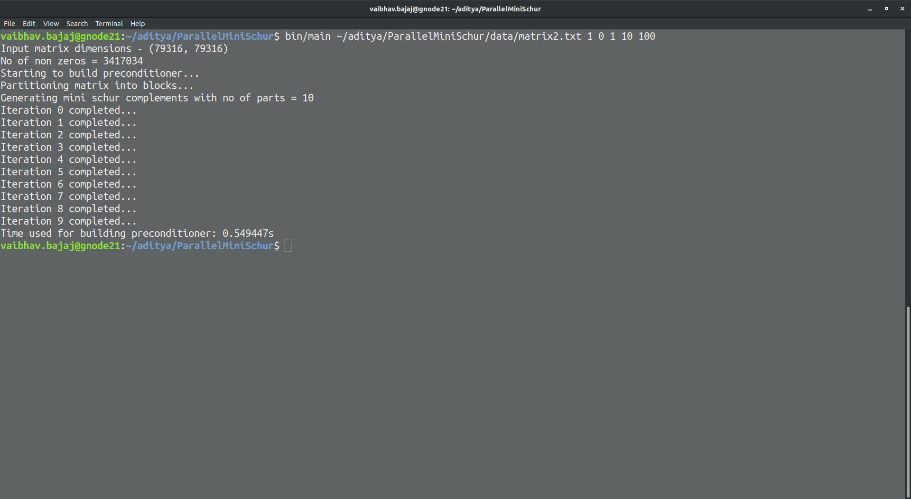

# ParallelMiniSchur
A parallel implementation in CUDA to get an approximate mini schur complement for large scale Bundle Adjustment Problem

## Installation Instructions
- To install the solver, you need to have cuda installed in your system
- Installation command - `make`
- A binary executable is formed in the `bin/` folder


## Running instructions
- The solver is run using the executable formed above
- The command line format to run the solver is as follows:
```
    bin/main [filename] [matrix_descr] [matrix_order] [matrix_index_format] [nparts] [sizeG]
```

- The command line options are explained below:
    - filename : the complete path to the matrix text file
    - matrix_descr : The code for matrix description (CSR - 0, COO - 1)
    - matrix_order : The code for matrix order (column major - 0, row major - 1)
    - matrix_index_format : The code for matrix index format (zero base indexing - 0, one base indexing - 1)
    - sizeG : The size of the G partition while building the preconditioner

## Sample run of the solver

